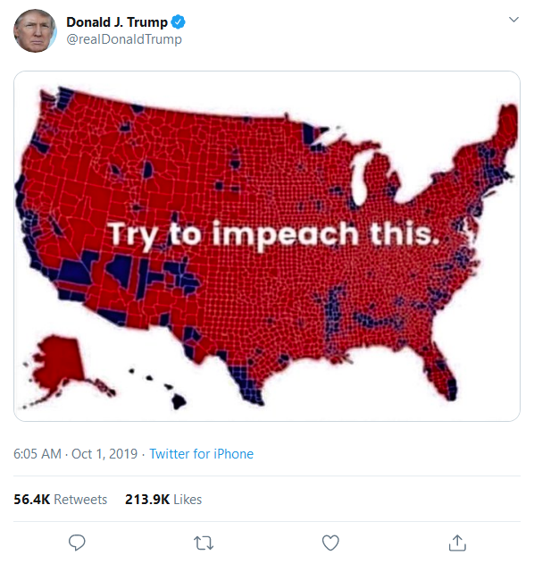

# Introduction

This is a timely map tutorial written mainly by professor Dr. Jonathan Gilligan at Vanderbilt. He wrote this for our class and I have made modifications to it. 

## Overview 
We take county-level vote data for the 2016 presidential election from the
[MIT Election Data and Sceince Lab](https://electionlab.mit.edu/) (MEDSL),
which is conveniently available as a `.csv` file at
GitHub: <https://github.com/MEDSL/county-returns>

Throughout this project, we will use FIPS (Federal Information Processing 
Standards) codes to identify states, counties, and census tracts. FIPS
codes use two-digit codes to identify each state and territory in the US.
Within each state each county receives a three-digit code and a county is 
uniquely identified by a five-digit FIPS code, where the first two digits 
identify the state and the next three identify the county.

# Wrangling the data --- OPTIONAL 

If you want to test your skills, come back to this part later, 
delete everything, and see how you might wrangle the data appropriately. 

Otherwise, do not worry too much about the wrangling code. This is hear for you to run. Focus on the maps. I could have just given you cleaned up objects for mapping.

## Wrangling process shown below

1. Load the full election data set from the `.csv` file, and filter to keep
only the rows for 2016 (the full set includes presidential elections from
2008--2016).

2. We have to fix up the FIPS code in the presidential election data 
because the `.csv` file from MEDSL represents them as integers, 
so state FIPS codes less than 10 are represented by a single-digit and need to 
be converted to character data with a leading zero so they will have two digits.
For this task, we use the formatC command.

- The Federal Information Processing Standard Publication 6-4 (FIPS 6-4) was a five-digit Federal Information Processing Standards code which uniquely identified counties and county equivalents in the United States, certain U.S. possessions, and certain freely associated states.

3. Also, the party affiliation of third-party and independent candidates are 
represented by `NA`, and we need to convert this to a character value, which
we will set equal to `"other"` using the `tidyverse` function `replace_na()`.


# package loading
```{r}
library(tidyverse)
library(dplyr)
library(tigris)
library(janitor)
library(sf)
library(scales)
library(tidycensus)
data_dir <- "data"
```

First read in the data csv and filter the year for 2016. 
Replace those annoying NAs. Reformate FIPS.

```{r load_data, cache = TRUE, cache.extra = c(file.mtime("data/MEDSL/county-returns/countypres_2000-2016.csv"))}
election_2016 <-
  read_csv("data/MEDSL/county-returns/countypres_2000-2016.csv") %>%
  filter(year == 2016) %>%
    mutate(party = replace_na(party, "other"),
           FIPS = formatC(FIPS, digits = 4, format = "d", flag = "0")) %>%
  filter(! is.na(state_po))
```

Let's take a look at the first few rows of the data frame:

```{r peek_raw_data, cache=TRUE, dependson = "load_data"}
glimpse(election_2016)
```

The original data frame is in a "long" format with one row for each party in
each county, but we want a column with the two-party vote margin, so we
to calculate the margin need to pivot the data frame to a "wide" format with
one row per state and one column for each party:

```{r wrangle_2016_data}
election_2016 <- election_2016 %>%
  select(state = state_po, party, county, FIPS, candidatevotes) %>%
  pivot_wider(names_from = "party", values_from = "candidatevotes") %>%
  filter(! is.na(democrat))

head(election_2016)
```

Next, we add the counties within a state to create a state-level data set.

For both state-level and county-level data, we create three new columns:
`total`, for the total votes cast, `margin` for the margin of victory as a
fraction of the total two-party vote (positive for Democratic victory and 
negative for Republican victory), and `winner` indicating the winner in 
that state or county.

Finally, a nagging detail we must take care of (data cleaning is very important!):

Shannon County SD (FIPS code 46113) changed its name to Oglala Lakota County
in 2015 and received a new FIPS code (46102), but the MEDSL data files are out 
of date and still list it as Shannon County with FIPS code 46113 so we need to 
fix this to make it consistent with the map and population data.

```{r state_data, cache=TRUE, dependson="load_data"}
state_votes <- election_2016 %>% group_by(state) %>%
  summarize_at(vars(democrat, republican, other), ~sum(., na.rm = TRUE)) %>%
  ungroup() %>%
  mutate(total = democrat + republican + other,
         margin = (democrat - republican) / (democrat + republican),
         winner = ifelse(democrat > republican, "Clinton", "Trump"))

county_votes <- election_2016 %>%
  mutate(total = democrat + republican + other,
         margin = (democrat - republican) / (democrat + republican),
         winner = ifelse(democrat > republican, "Clinton", "Trump"),
         FIPS = ifelse(FIPS == "46113", "46102", FIPS))

head(state_votes)
```

Now we have the data and we want to get polygons with the shapes of the states
and counties. We use the U.S. Census's TIGR maps, which we get with the
`tigris` package and then we convert them to `sf` ("**simple feature**") data 
frames.

**Simple feature** data frames look very much like the `tibble` data frames 
you are used to from _R for Data Science_, but they have one special column 
called `geometry`, which is treated differently from the other columns. 
This column contains the shapes for the _simple features_. Each row can have
a polygon, a set of multiple polygons, a point, a set of points, 
or other types of spatial data. Each row can have a different type 
of _simple feature_. The term _simple feature_ refers to a formal standard
(ISO 19125-1:2004), that specifies a uniform digital representations 
of spatial geometry objects. This specification serves as the basis for 
geometrical representations in popular geospatial software inclusing ArcGIS,
the PostGIS database, and the GeoJSON file format.

What is a shape file? (THIS IS REVIEW FROM LECTURE)

- The shapefile format is a geospatial vector data format for geographic information system (GIS) software
- The shapefile format stores the data as primitive geometric shapes like points, lines, and polygons. 
- These shapes, together with data attributes that are linked to each shape, create the representation of the geographic data. 
- The term "shapefile" is quite common, but the format consists of a collection of files with a common filename prefix, stored in the same directory. The three mandatory files have filename extensions .shp, .shx, and .dbf.
- Use option tigris_use_cache to tell tigris to cache Census shapefile downloads. 

```{r load_maps, cache=TRUE, dependson="state_data", message = FALSE}
options(tigris_use_cache = TRUE, tigris_refresh = FALSE)

state_map_file  <- file.path(data_dir, "maps", "state_maps.Rds")
county_map_file <- file.path(data_dir, "maps", "county_maps.Rds")

state_maps <- states(cb = TRUE, year = 2016, progress_bar = FALSE, 
                       class = "sf") %>% clean_names() %>% rename(c("state" = "stusps"))

saveRDS(state_maps, state_map_file)

county_maps <- counties(state = c(state.abb, "DC"), cb = TRUE, year = 2016, 
                          progress_bar = FALSE, class = "sf") %>% clean_names()

saveRDS(county_maps, county_map_file)

glimpse(state_maps)
```

Now we join the map data frames to the election return data frames.
This will produce data frames that combine the voting return data with 
geometric representation of states or counties for mapping.

```{r join_data, cache=TRUE, dependson=c("state_data", "load_maps")}
state_maps <- state_maps %>% inner_join(state_votes, by = "state")
county_maps <- county_maps %>% inner_join(county_votes, by = c(geoid = "FIPS"))
```
# note: careful, if you re-run the above code state_maps have been updated and you will likely get an  error. Be careful to start with a fresh clear environment, and then run the code. Considering saving these objects as R objects if you run into this. 

### Maps election state and county map

Now we are ready to make some maps!

For graphical simplicity, we will leave off Alaska and Hawaii.
If you want to make compact maps that display these states offset to fit
nicely around the contiguous 48 states, look at the `usmap` package.

We also project the maps onto a plane using the NAD83 projection. 
This uses the 1983 North American Datum, an Albers equal-area conic
projection optimized to minimize distortions in the 48 contiguous states.

```{r omit_ak_hi, cache = TRUE}
state_maps <- state_maps %>% filter(! state %in% c("AK", "HI")) %>%
  st_transform("+init=epsg:5070")   # NAD83

county_maps <- county_maps %>% 
  filter(! statefp %in% c("02", "15"), ! state %in% c("AK", "HI")) %>%
  st_transform("+init=epsg:5070")  # NAD83
```

## State-Level Maps

First, we can make a simple map that shows the winner of each state as red or 
blue (this might take a moment to print on your computer, be patient):

```{r state_winner, fig.cap="A map of the winner of the 2016 presidential election in each state.", fig.scap="A map of states showing the winners.", cache = TRUE, dependson="omit_ak_hi"}
  ggplot(state_maps, aes(fill = winner)) + geom_sf() +
  scale_fill_manual(values = c(Clinton = "blue", Trump = "red"), 
                    name = "Winner")
```

This gives a strong sense of how many states went red or blue in the election,
and since each state except Nebraska and Maine award all of their electoral 
votes to the winner of a plurality of votes, it is informative.

#### Mapping the Margin of Victory

But we may want to know something about the margin of victory in each state.
Here we map the margin of victory (Democratic minus Republican votes divided
by the two-party total) to a gradient that goes from bright red to bright blue
with white for a margin of zero (a tie):

```{r state_margin, fig.cap="\\label{fig:state_margin}A map of the margin of victory in the 2016 presidential election for each state. The margin of victory is defined as $(\\text{Democratic votes} - \\text{Republican votes}) / (\\text{Democratic votes} + \\text{Republican votes})$, so positive numbers correspond to a Democratic victory and negative numbers to a Republican victory.", fig.scap="A map of states showing the margin of victory.", cache=TRUE, dependson="omit_ak_hi"}
  ggplot(state_maps, aes(fill = margin)) + geom_sf() +
  scale_fill_gradient2(high = "blue", low = "red", mid = "white",
                       name = "Vote margin", labels = percent_format())
```

This gives a clearer sense that some states had a much greater margin than 
others, but many close states just appear in white, so we don't know who won 
them.

What may be helpful here would be to clip the vote margin at 10% or so (which
is a landslide margin already), in order to have better color discrimination
in the close states:

```{r state_margin_clipped, fig.cap="Similar to Fig. \\ref{fig:state_margin}, but with the margin limited to the range $-10\\%$--$+10\\%$", fig.scap="A map showing margin of victory limited to the range $-10\\%$--$+10\\%$.", cache=TRUE, dependson="omit_ak_hi"}
  state_maps %>% 
  mutate(margin = raster::clamp(margin, -0.10, 0.10)) %>%
  ggplot(aes(fill = margin)) + geom_sf() +
  scale_fill_gradient2(high = "blue", low = "red", mid = "white",
                       name = "Vote margin",
                       breaks = seq(-0.1, 0.1, 0.05),
                       labels = c("< -10%", "-5%", "0", "5%", "> 10%"))
```

This gives a clearer sense of the election with most states going to one
candidate or the other by a very large margin, but some states being much 
closer.

A few states are still too close to tell with this color scheme: Michigan,
New Hampshire, Pennsylvania, and Wisconsin all had margins of victory less 
than 1%:

```{r mi_pa_nh_margin, cache=TRUE, dependson="omit_ak_hi"}
state_votes %>% filter(state %in% c("MI", "NH", "PA", "WI")) %>%
  select(state, democrat, republican, margin) %>%
  arrange(abs(margin)) %>%
  mutate(margin = percent(margin, accuracy = 0.01))
```

An alternate visualization would use a muted purple instead of white as the
intermediate color for states with small margins of victory for either party:

```{r state_margin_purple, fig.cap="Mapping the margin of victory with a different color scheme, where close elections are represented by a muted purple color.", fig.scap="Mapping the margin of victory with a different color scheme.", cache=TRUE, dependson="omit_ak_hi"}
  state_maps %>% mutate(margin = raster::clamp(margin, -0.10, 0.10)) %>%
  ggplot(aes(fill = margin)) + geom_sf(color = "gray90") +
  scale_fill_gradient2(high = "blue", low = "red", mid = muted("purple"),
                       name = "Vote margin",
                       breaks = seq(-0.1, 0.1, 0.05),
                       labels = c("< -10%", "-5%", "0", "5%", "> 10%"))
```

## County-Level Mapping

All the states except Nebraska and Maine award all of their electoral votes to
the candidate who receives the most total votes. Thus, state-level maps are
the most directly relevant to understanding the winner, but states are not
homogeneous and it can be useful to examine maps at the county level to see
how votes are distributed within the states.

First, we can make a simple map that shows the winner of each state as red or 
blue (again this could take a moment):

```{r county_winner, fig.cap="A map of the winner of the 2016 presidential election in each county in the 48 contiguous states.", fig.scap="A map of county winners.", cache = TRUE, dependson="omit_ak_hi"}
county_maps %>% 
  mutate(winner = factor(ifelse(margin > 0, "Clinton", "Trump"))) %>%
  ggplot(aes(fill = winner)) + geom_sf(color = "gray50") +
  scale_fill_manual(values = c(Clinton = "blue", Trump = "red"), 
                    name = "Winner")
```

This is a map strongly favored by President Trump because it shows that he
won the overwhelming majority of counties in the US. Indeed, President Trump
tweeted an inaccurate version of this map on Oct.~1, 2019 with the caption
"Try to impeach this" (see Fig. \ref{fig:impeach-this}).

{#fig:impeach-this}

Critics quickly pointed out first that President Trump had tweeted an inaccurate
map and also that this way of presenting 
a map did not account for the numbers of votes, either with regard to the 
margin of victory or the different populations in different counties
(see, for instance <https://www.snopes.com/news/2019/10/02/donald-trump-impeach-this-map/>)

Thus, it may be useful to compare this map with one that uses a gradient color
scale to represent the margin of victory in each county, much as we did for the 
state-level maps:

```{r county_margin, fig.cap="Margin of victory in each county in the 2016 presidential election", fig.scap="Margin of victory in each county", cache=TRUE, dependson="omit_ak_hi"}
county_maps %>%
  ggplot(aes(fill = margin)) + geom_sf() +
  scale_fill_gradient2(high = "blue", low = "red", mid = "white",
                       name = "Vote margin", labels = percent_format())
```

And here is the same map, but using a muted purple instead of white for a margin
of 0%:

```{r county_margin_purple, fig.cap="Margin of victory in each county, with the muted purple color scheme", cache=TRUE, dependson="omit_ak_hi"}
  county_maps %>%
  ggplot(aes(fill = margin)) + geom_sf() +
  scale_fill_gradient2(high = "blue", low = "red", mid = muted("purple"),
                       name = "Vote margin", labels = percent_format())
```

### Cartograms

Another approach is to use what are called **cartograms**, which distort the 
map to make areas of the states proportional to some quantity, such as
population or electoral votes. Here, we create a cartogram of the states
weighted so their areas are proportional to the population.

We take the population from the `usmaps` package, which contains the 2015
population of each state, based on the U.S. Census Bureau's 2015 American 
Community Survey. 

If we wanted to be more precise, we could use the `tidycensus` package to 
download the 2016 state populations from the Census Bureau, but 2015 will
be close enough for this demonstration project.

```{r state_cartogram, message = FALSE, cache=TRUE, dependson="omit_ak_hi"}
state_pop <- usmap::statepop %>% 
  select(statefp = fips, pop = pop_2015)

new_state_data <- state_maps %>%
  left_join(state_pop, by = "statefp") %>%
  select(winner, margin, pop)

# Cartogram weighted by number of votes in each state
state_cartogram_file <- file.path(data_dir, "maps", "state_cartogram.Rds")
cgram_st_c <- cartogram_cont(new_state_data, "pop")
saveRDS(cgram_st_c, state_cartogram_file)

```

```{r plot_state_cartogram, fig.cap="Cartogram map of the margin of victory in states. The cartogram distorts the shape of each state so the area is proportional to the population.", fig.scap="Cartogram of state margins of victory", cache=TRUE, dependson="state_cartogram"}
ggplot(cgram_st_c, aes(fill = margin)) + geom_sf() +
  scale_fill_gradient2(low = "red", high = "blue", mid = "white",
                       breaks = seq(-0.10, 0.10, 0.05),
                       labels = c("< -10%", "-5%", "0", "5%", "> 10%"))
```


